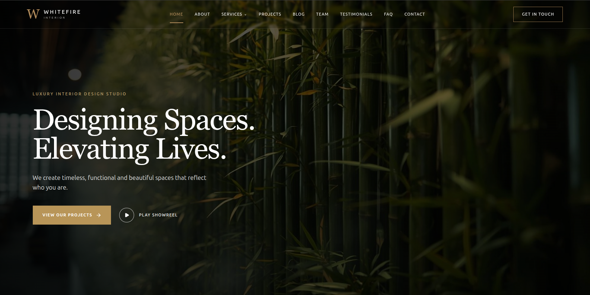

# Whitefire Interior — Interior Design Studio Website

A production-grade, CMS-driven website for **Whitefire Interior**, an Amsterdam interior design studio. Editorial, cinematic, and warm — built on a strict 1440px stage with an ambient background, so the site reads as a framed piece of design work on every screen.

**Live site:** [interior-deco-kappa.vercel.app](https://interior-deco-kappa.vercel.app/)



---

## Table of Contents

1. [Overview](#overview)
2. [Features](#features)
3. [Tech Stack](#tech-stack)
4. [Architecture](#architecture)
5. [Design System](#design-system)
6. [Sanity CMS Integration](#sanity-cms-integration)
7. [Forms, Validation & Rate Limiting](#forms-validation--rate-limiting)
8. [Security](#security)
9. [Performance](#performance)
10. [Accessibility](#accessibility)
11. [SEO](#seo)
12. [Getting Started](#getting-started)
13. [Scripts](#scripts)
14. [Local Verification Workflow](#local-verification-workflow)
15. [Deployment & Known Issues](#deployment--known-issues)

---

## Overview

Whitefire Interior is a fully server-rendered marketing site with:

- **13 public routes** — home, about, services (index + 8 detail pages), projects (index + details), blog (index + details), team (index + details), testimonials, FAQ, contact, and privacy policy
- **Sanity CMS as the single source of truth** — every page's content (heroes, services, projects, articles, team, testimonials, site config, contact info) is fetched live via GROQ on every request; content updates in Sanity appear immediately
- **Two live form endpoints** — newsletter signup and contact form, both writing submissions back into Sanity with full validation, honeypot, and rate limiting
- **A deliberate visual system** — all content is capped at 1440px and sits on a fixed ambient background image, creating a consistent "stage" on any viewport width

---

## Features

| Area | Details |
|---|---|
| **Home** | Hero with rotating imagery, 8-service overview, studio statement, testimonials slider (Swiper, lazy-loaded), client logo grid, featured projects, stats band, latest articles, newsletter section |
| **Services** | 8 detail pages (living spaces, kitchens & dining, bedrooms & retreats, workspaces, hospitality & retail, boutique & transitional, minimalist & Scandinavian, compact & micro spaces) with hero, inclusions, process steps, and gallery |
| **Projects** | Filterable portfolio (category filters), detail pages with full project narrative |
| **Blog** | Article index with category + search filters, article detail pages with author, metadata, and related reading |
| **Team** | Team index with empty-state handling and individual member detail pages |
| **Testimonials** | Verified client reviews with location |
| **Contact** | Contact form, studio information, and embedded Google Map (lazy-loaded, `referrerPolicy` set) |
| **Newsletter** | Email capture with GDPR consent, honeypot, and success/already-subscribed states |
| **Privacy** | Plain-language privacy policy page, linked from footer, contact form, and all newsletter notes |
| **SEO** | Canonical URLs, Open Graph/Twitter meta, JSON-LD structured data (Organization + LocalBusiness), XML sitemap (50 URLs), robots.txt, llms.txt |

---

## Tech Stack

| Layer | Technology |
|---|---|
| Framework | [Remix 2](https://remix.run/) (React Router under the hood) |
| Language | TypeScript (strict) |
| Rendering | Full SSR; all data fetched in `loader`s |
| Styling | Tailwind CSS 3 with arbitrary-value utilities |
| CMS | [Sanity](https://www.sanity.io/) (`pzhistba` project, `production` dataset) — GROQ queries, no CMS SDK on the client |
| Carousel | Swiper 8 (CSS vendored locally, JS lazy-loaded) |
| Icons | lucide-react |
| Bot detection | isbot |
| Hosting | Vercel (`interior-deco-kappa.vercel.app`) |

---

## Architecture

### Route map (`app/routes/`)

```
/                  _index.tsx            Home
/about             about.tsx
/services          services._index.tsx   Services overview
/services/:slug    services.$slug.tsx    8 service detail pages
/projects          projects._index.tsx   Filterable portfolio
/projects/:id      projects.$projectid.tsx
/blog              blog._index.tsx       Articles + category/search filters
/blog/:slug        blog.$slug.tsx
/team              team._index.tsx
/team/:slug        team.$slug.tsx
/testimonials      testimonials.tsx
/faq               faq.tsx
/contact           contact.tsx
/privacy           privacy.tsx
/sitemap.xml       sitemap[.]xml.tsx     50 URLs, always-current
/robots.txt        robots[.]txt.tsx
/llms.txt          llms[.]txt.tsx        Content overview for LLMs
```

### Key directories

| Path | Purpose |
|---|---|
| `app/root.tsx` | Global layout: shell, header/footer mounting, security headers, error boundary (404 vs 500 views) |
| `app/routes/` | One file per route; loaders fetch Sanity data, actions handle form POSTs |
| `app/components/whitefire/` | Shared UI: `SiteHeader`, `SiteFooter`, `SiteLogo`, `ResponsiveImage`, `NewsletterForm`, `ClientTestimonials`, cards, breadcrumbs |
| `app/lib/sanity.ts` | Sanity read client (`useCdn: false`) + write client (token from env only) |
| `app/lib/content.ts` | All GROQ queries and typed data mappers |
| `app/lib/forms.ts` | Shared form handling: parsing, honeypot, rate limiting, validation, Sanity writes |
| `app/utils/seo.tsx` | `seo()` meta helper, JSON-LD, canonical generation |

### Data flow

```
Request → loader (server) → GROQ query (parameterized, no interpolation)
       → typed mapper → json() → client components render
POST    → action (server) → parseForm → honeypot → validation → rate limit → Sanity write
```

---

## Design System

### The 1440px stage

Everything — header, main content, and footer — is capped at **1440px** and centered:

```
<main id="main" className="mx-auto w-full max-w-[1440px] flex-grow">
```

On viewports wider than 1440px, the margins are the warm cream (`#F5EFE2`) — the same light surface used inside the routes — so the page reads as one continuous surface.

### Color direction

| Token | Value | Usage |
|---|---|---|
| Cream | `#F5EFE2` | Body background and page surfaces |
| Ivory surface | `#F7F4EE` | Main content surfaces |
| Beige | `#E8E2D8` | Section/page backgrounds |
| Charcoal | `#151514` / `#171716` | Footer, stats, dark sections |
| Bronze | `#B08A5A` / `#9A7A4A` | Accents, eyebrows, active states |
| Text | `#171615` / `#37332E` | Body copy on light surfaces |

### Typography

- Serif display for headlines (font-serif)
- Sans-serif for body/navigation
- Uppercase, wide-tracked eyebrows (`tracking-[0.22em]`+)

---

## Sanity CMS Integration

- **Project:** `pzhistba` · **Dataset:** `production`
- **Read client** — `useCdn: false` (always-fresh reads; no stale cache)
- **Write client** — used **only on the server** (form submissions, admin patches); token comes exclusively from `process.env.SANITY_API_WRITE_TOKEN` and is **never** bundled to the client (verified: `writeClient` is tree-shaken out of every client chunk)
- **GROQ hygiene** — every query is parameterized (`$slug`, `$email`); zero string-interpolated queries, so there is no injection surface
- **Schemas used:** `siteConfig`, `contactPage`, `servicePage`, `project`, `article`, `teamMember`, `testimonial`, `newsletterSubscriber`, `contactSubmission`

Content edits in the Sanity Studio are reflected on the next request — no rebuild needed.

---

## Forms, Validation & Rate Limiting

### Newsletter (`?index` POST) and Contact (`/contact` POST)

Both forms share the same hardened pipeline (`app/lib/forms.ts`):

1. **Method check** — non-POST requests get 405
2. **Honeypot** — hidden `website` field; if filled, the handler returns a fake `ok: true` without writing (bots believe they succeeded)
3. **Field validation** — email format + length caps (`FIELD_LIMITS`), required fields, GDPR consent required for newsletter; failures return 400 with per-field messages
4. **Rate limiting** — in-memory, 5 submissions per IP per 10 minutes, enforced **after** validation so invalid spam can't exhaust the budget; over-limit returns 429 "Too many submissions"
5. **Deduplication** — newsletter checks for an existing subscriber first and returns `alreadySubscribed`
6. **Sanity write** — `newsletterSubscriber` / `contactSubmission` documents with timestamp and source; failures return a generic 500

All responses are structured (`ok`, `errors`, `error`, `alreadySubscribed`) so the UI can render success/error states without exceptions.

---

## Security

| Layer | Implementation |
|---|---|
| **Security headers** | Set globally via `headers()` in `app/root.tsx`: CSP, HSTS (2y, includeSubDomains), `X-Frame-Options: DENY`, `X-Content-Type-Options: nosniff`, `Referrer-Policy: strict-origin-when-cross-origin`, `Permissions-Policy` (camera/mic/geo/payment/usb blocked) |
| **CSP** | `default-src 'self'`; scripts/styles `'self' 'unsafe-inline'` (Remix loader-data scripts); images `'self' data: https://cdn.sanity.io`; frames only Google Maps; `frame-ancestors 'none'`; `object-src 'none'`; `base-uri 'self'`; `form-action 'self'` |
| **Token hygiene** | Write token exists only in `.env` (git-ignored); never in code, bundles, or HTML — verified by grepping the production build |
| **No cookies, no sessions** | Stateless site; form CSRF risk is negligible (public POSTs only) |
| **Request validation** | Honeypot + field limits + email pattern on every form |
| **Injection** | Parameterized GROQ everywhere; no `dangerouslySetInnerHTML` except JSON-LD of own data |
| **Third-party surface** | Zero analytics/tracking scripts; the only external embed is the Google Map iframe |

---

## Performance

Measured with Lighthouse (desktop, local production build): **Performance 99 · Accessibility 95 · Best Practices 92 · SEO 100**; LCP 0.6s, CLS 0, TBT ~10ms.

Key techniques:

- **`ResponsiveImage` component** — all ~35 images across the site use Sanity's image CDN with `srcset` (640/1024/1600/1920), `auto=format&q=85` (WebP/AVIF), intrinsic `width`/`height` from the asset filename (zero CLS), and `fetchpriority="high"` on LCP images
- **No third-party scripts** — no fonts, no analytics, no tag managers; swiper CSS is vendored locally (`public/vendor/swiper-bundle.min.css`) instead of loading from a CDN
- **Lazy loading** — the homepage testimonials carousel (Swiper) is loaded via dynamic `import()`; home JS payload ~40KB
- **Route splitting** — Remix code-splits per route; only the needed chunk ships

---

## Accessibility

- `:focus-visible` outline styled globally (`#B08A5A`)
- Skip-link-friendly single `<main id="main">` landmark
- Full keyboard navigation: mobile menu closes on `Escape`, all controls are real `<button>`/`<a>` elements
- `aria-label` on icon-only controls (menu, carousel arrows), `aria-expanded` on the menu toggle, `aria-labelledby` on sections
- Decorative imagery uses `aria-hidden` / empty `alt`; meaningful images carry descriptive `alt` text
- Color contrast maintained on all surfaces; success/error form states are text-based, not color-only

---

## SEO

- **Per-route meta** — unique titles, descriptions, canonical URLs (via `seo()` helper) and Open Graph/Twitter tags
- **Structured data** — JSON-LD `Organization` and `LocalBusiness` (with address, geo, opening hours) on every page
- **Sitemap** — `/sitemap.xml` generated from the actual route list (50 URLs, always in sync)
- **robots.txt + llms.txt** — crawler guidance and an LLM-readable content overview
- **404 correctness** — unknown slugs return real 404s with a branded "Page not found" view (canonical handling verified for trailing slashes and case variants)

---

## Getting Started

### Prerequisites

- Node.js 18+
- A Sanity project (`pzhistba`-style) with a **write token** for form submissions

### Setup

```bash
npm install
```

Create `.env` (git-ignored):

```
SANITY_API_WRITE_TOKEN=sk_your_token
```

> Only the write token is needed for the server to run; reads are tokenless. Without a valid token, form submissions return a friendly error but the site renders normally.

### Run

```bash
npm run dev        # development server on :3000
npm run build      # production build
npm run start      # serve the production build
```

---

## Scripts

| Script | Purpose |
|---|---|
| `npm run dev` | Remix dev server with HMR |
| `npm run build` | Production build (server + client) |
| `npm run start` | `remix-serve` on the production build |
| `npm run lint` | ESLint across the project |
| `npm run typecheck` | `tsc --noEmit` |

---

## Local Verification Workflow

The project is verified end-to-end before every commit:

1. **Build + typecheck** — `npx tsc --noEmit` and `npm run build` must be clean
2. **Serve** — `remix-serve ./build/index.js` (with `.env` sourced)
3. **URL sweep** — every URL in `/sitemap.xml` (50) must return 200
4. **Form tests** — validation failures → 400 with messages; honeypot → fake success with **no** Sanity write; real submissions land in Sanity and are cleaned up afterwards
5. **Rendered checks** — headless Chrome (puppeteer-core via the project's Lighthouse install) samples computed styles/pixel colors to verify layout invariants (e.g., stage widths at 1440, ambient background on the margins)
6. **Lighthouse** — performance/a11y/SEO regression checks with reports under `~/lighthouse/reports/`

---

## Deployment & Known Issues

**Deployment:** Vercel — the repo deploys from `main`; production build is fully server-rendered.

**Known pre-existing issues on the live site** (not present locally, not caused by local work — surfaced during route audits):

- `/blog` returns 500 on production
- Blog, team, and services **detail pages** return 404 on production (route/indexing drift on the deployed build)

A redeploy of the current `main` branch resolves both — local verification shows 50/50 URLs returning 200, including all detail pages.